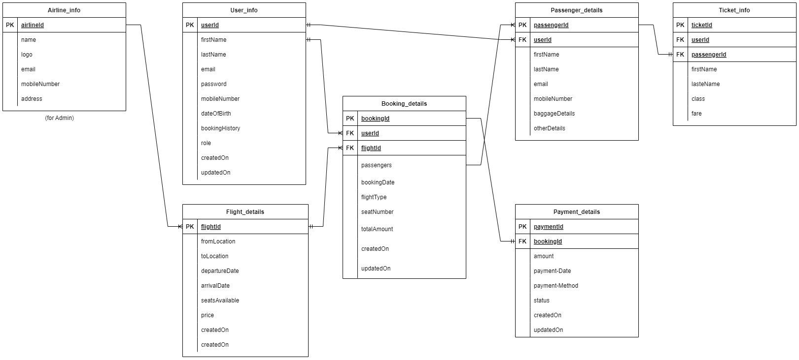

# Technical Specification Document
## 1. Title Page
- **Project name**: Airline Booking System
- **Version**: 1.0.0
- **Date**: August 1, 2024
- **Authors**: John Rey Balolot, Jan Ren De Las Alas,  Mel An Nicole Geronimo, Dan Leoncito

## 2. Table of Contents
- [Introduction](https://github.com/reybalolot/airline-booking-system?tab=readme-ov-file#3-introduction)
- [Overall Description](https://github.com/reybalolot/airline-booking-system?tab=readme-ov-file#4-overall-description)
- [Visual Mockup Reference](https://github.com/reybalolot/airline-booking-system?tab=readme-ov-file#5-visual-mockup-reference)
- [Features](https://github.com/reybalolot/airline-booking-system?tab=readme-ov-file#3-introduction)
- [Functional Requirements](https://github.com/reybalolot/airline-booking-system?tab=readme-ov-file#7-functional-requirements)
- [Non-Functional Requirements](https://github.com/reybalolot/airline-booking-system?tab=readme-ov-file#8-non-functional-requirements)
- [Data Requirements](https://github.com/reybalolot/airline-booking-system?tab=readme-ov-file#9-data-requirements)
- [External Interface Requirements](https://github.com/reybalolot/airline-booking-system?tab=readme-ov-file#10-external-interface-requirements)
- [Glossary](https://github.com/reybalolot/airline-booking-system?tab=readme-ov-file#11-glossary)
- [Appendices](https://github.com/reybalolot/airline-booking-system?tab=readme-ov-file#12-appendices)

## 3. Introduction
### **Purpose**
To develop and design a user-friendly airline booking application that simplifies the flight booking process, allowing users to search for flights, complete bookings, process payments, and manage their flight details efficiently.
### **Scope**
The application will include user registration, flight search, booking, payment processing, and flight management. It will support multiple payment methods, provide real-time flight status updates, and offer profile management for personal and payment information. The scope excludes advanced functionalities such as reviews and ratings, airport transfers, travel advisory alerts, and multi-currency support, and lastly, multi-city itineraries.
### **Definitions, Acronyms, and Abbreviations**
To be added
### **References**
None

## 4. Overall Description
### **Product Perspective**
A sophisticated airline booking app designed to streamline the flight reservation process. By focusing on efficiency and user experience, the app integrates real-time data and advanced algorithms to offer a seamless journey from searching for flights to finalizing bookings. We aim to simplify travel planning with a modern, intuitive interface and comprehensive features.

### **Product Functions**
- Flight Search
	- Multi-Criteria Search: Allows users to search for flights based on parameters such as dates, times, departure and arrival airports. Enables filtering by flight duration, layovers, airline preferences, and price range.

- Booking Management
	- One-Click Booking: Facilitates quick reservations using saved user preferences and payment details.
	- Multi-Passenger Booking: Supports booking for multiple passengers, including options for special requirements like child seats or additional baggage.

- Payment and Checkout
	- Multiple Payment Options: Supports various payment methods, including credit/debit cards, and digital wallets.
	- Secure Payment Processing: Ensures secure transactions and protects user payment information with encryption and compliance with payment standards.

- Real-Time Updates
	- Flight Status Tracking: Provides real-time updates on flight status, including delays, cancellations, and gate changes.
	- Booking Confirmation Alerts: Sends immediate confirmation of bookings and reminders for upcoming flights.

- User Account Management
	- Profile Management: Allows users to create and manage profiles with personal details, travel preferences, and flight history.
	- Booking History: Provides access to past and upcoming bookings with options to view, modify, or cancel reservations.

- Customer Support
	- Help Center: Includes a comprehensive FAQ section and troubleshooting guides for common issues.

- Notifications and Alerts
	- Booking Reminders: Sends reminders for upcoming flights, check-in deadlines, and other important travel-related notifications.
	- Custom Alerts: Enables users to set custom alerts for specific flight details or changes.

### **User Classes and Characteristics**

1. **Individual Travelers**
	Characteristics:
	- Tech-Savvy: Varied levels, from novice to expert.
	- Demographics: Wide range of ages, incomes, and travel purposes (leisure, business, etc.).
    Needs:
    - User-friendly interface for booking and managing flights.
    - Detailed information on flight options, prices, and schedules.
    - Access to booking history and loyalty program details.
    - Notifications for flight status, check-in reminders, and promotions.

2. **Corporate Clients**
	Characteristics:
	- Tech-Savvy: Generally proficient with digital tools.
	- Demographics: Business professionals, travel coordinators, executive assistants.
	Needs:
	- Ability to manage multiple bookings for employees.
	- Access to corporate discounts and negotiated rates.
	- Detailed reporting and expense management tools.
	- Easy modifications and cancellations for business trips.

3. **Travel Agencies**
	Characteristics:
	- Professional Use: High frequency of use for booking and managing client travel.
	- Tech-Savvy: Proficient with booking systems and travel management tools.
	Needs:
	- Access to a wide range of flight options and fare classes.
	- Tools for managing multiple client itineraries and special requests.
	- Detailed reporting and invoicing capabilities.
	- Integration with other travel services (hotels, car rentals).

4. **Airline Operations Staff**
	Characteristics:
	- Operational Use: Use for managing flight operations and passenger data.
	- Tech-Savvy: High proficiency with backend systems and operations software.
	Needs:
	- Real-time access to flight schedules, passenger manifests, and seat assignments.
	- Tools for handling check-ins, upgrades, and special service requests.
	- Integration with other airline systems (baggage handling, security).
	- Reporting tools for operational efficiency and compliance.

5. **System Administrators**
	Characteristics:
	- Technical Expertise: Responsible for system maintenance, security, and performance.
	- Tech-Savvy: Advanced technical knowledge and experience with IT systems.
	 Needs:
	- User management and role-based access control.
	- System monitoring and maintenance tools.
	- Access to logs and diagnostics for troubleshooting.
	- Tools for system updates and patch management.

7. **Marketing and Sales Teams**
	Characteristics:
	- Customer Engagement: Focus on driving sales and user engagement.
	- Tech-Savvy: Proficient with digital marketing tools and analytics.
	Needs:
	- Access to user data for targeted marketing campaigns.
	- Tools for managing promotions, discounts, and loyalty programs.
	- Analytics to measure campaign effectiveness and user behavior.
	- Integration with CRM systems for personalized marketing.

8. **Customer Support Representatives**
	Characteristics:
	- Support Role: Assist users with booking issues and inquiries.
	- Tech-Savvy: Proficient with customer support tools and the system’s interface.
	 Needs:
	- Access to user accounts, booking details, and flight information.
	- Tools for resolving issues, processing refunds, and handling complaints.
	- Knowledge base and FAQs for common issues.
	- Communication tools for live chat, email, and phone support.

### **Operation Environment**
This document outlines the hardware and software specifications required for the successful deployment and operation of an Airline Booking System. The system is designed to handle a high volume of transactions, ensuring reliability, scalability, and security.

**Software Specifications**
- Operating Systems
	Servers:
	- Linux Distribution: Ubuntu Server 20.04 LTS or CentOS 8
	- Windows Server: 2019 (if required for specific applications)
- Application Software
	Web Server
	- Apache HTTP Server: 2.4 or higher
	- Nginx: 1.18 or higher
	Application Server Software
	- Node.js 14.0 or higher
	- Express JS 4.0 or higher
	Database Management System (DBMS)
	- NoSQL: MongoDB

**Hardware Specifications**
- Servers
- Application Server: Handles the business logic and user interface.
	- CPU: 16-core, 2.5 GHz or higher
	- RAM: 64 GB or higher
	- Storage: 2 TB SSD
	- Network: 1 Gbps
- Database Server: Manages the airline booking database.
	- CPU: 32-core, 2.5 GHz or higher
	- RAM: 128 GB or higher
	- Storage: 10 TB SSD
	- Network: 1 Gbps
- Web Server: Serves static content and handles user requests.
	- CPU: 8-core, 2.5 GHz or higher
	- RAM: 32 GB or higher
	- Storage: 1 TB SSD
	- Network: 1 Gbps
- Load Balancer: Distributes incoming traffic across multiple servers.
	- CPU: 4-core, 2.5 GHz or higher
	- RAM: 16 GB or higher
	- Storage: 500 GB SSD
	- Network: 1 Gbps
### **Assumptions and Dependencies**
#### Assumptions
1. **User Behavior**:
	- Users are familiar with the steps involved in booking a flight.
	- Users have access to a stable internet connection.
	- Users will input accurate personal and payment information.
	- Users will search for flights within realistic date ranges and not at the last minute.
2. **System Performance**:
	- The system can handle peak traffic during high-demand periods (e.g., holidays).
	- The website will have high availability with minimal downtime.
	- Real-time updates from airlines (e.g., seat availability, flight status) are consistently accurate.
3. **Data Integrity**:
	- The airline’s API provides reliable and up-to-date flight information.
	- Payment gateways are secure and comply with industry standards.
	- User data is securely stored and complies with GDPR or other relevant data protection laws.
4. **Technology**:
	- The website will be compatible with modern web browsers (Chrome, Firefox, Safari, Edge).
	- Third-party services (e.g., Google Maps for airport locations, email services for booking confirmations) will be reliable and have minimal downtime.
	- The website will support both desktop and mobile users (responsive design).

#### Dependencies
1. **Third-Party APIs**:
	- Dependency on airlines’ APIs for flight schedules, availability, and booking capabilities.
	- Payment gateway integration (e.g., Stripe, PayPal, Gcash, Maya, BPO, BPI, Metrobank, RCBC, DragonPay) for processing transactions.
	- Integration with external services for travel insurance, hotel bookings, or car rentals (if applicable).
2. **Infrastructure**:
	- Web hosting and cloud services (e.g., AWS, Azure) for deploying the website.
	- Database services for storing user data, bookings, and flight information (MongoDB).
	- Load balancers and content delivery networks (CDNs) for ensuring website performance and availability (SEO).
3. **Development Tools**:
	- Dependency on specific development frameworks and libraries (e.g., React, Node.js, Express) for building the website.
	- Version control systems (e.g., Git) for managing code changes and collaboration.
4. **Regulatory Compliance**:
	- Compliance with industry standards (e.g., payment processing, reimbursement and claims, ).
	- Adherence to local and international laws regarding data privacy and consumer rights.

## 5. Visual Mockup Reference
[FIGMA MOCK UP - AIRLINE BOOKING SYSTEM](https://www.figma.com/design/UCFyEpOdwPIYoiQ0Ho0pki/ABS---Prototype?node-id=0-1&t=lANP5982FRwRYA34-1)
## 6. Features
### Key Features
1. **User Registration and Login**
	- Allows users to create an account and log in; Integration with OAuth for social logins (e.g., Google, Facebook).
2. **Profile Management**
	- Enables users to view and update their personal information.
	- Includes profile picture upload, password change, and contact information.
3. **Flight Search**
	- Allows users to search for flights based on criteria such as origin, destination, dates, and number of passengers.
	- Advanced search filters for direct flights, layovers, and airline preferences.
4. **Flight Booking**
	- Facilitates booking of flights.
	- Selection of flight class (economy, business, first), meal preferences, and special assistance.
5. **Payment Gateway Integration**
	- Supports multiple payment methods for flight booking.
	- Credit/debit cards, PayPal, digital wallets, and installment plans.
6. **Booking Management**
	- Allows users to view, modify, or cancel their bookings.
	- Displays booking details, cancellation policies, and rescheduling options.
7. **E-Tickets and Boarding Passes**
	- Generates and emails e-tickets and boarding passes.
	- QR code generation for mobile boarding passes
8. **Flight Status Tracking**
	- Provides real-time updates on flight status.
	- Delay notifications, gate changes, and departure/arrival information.
9. **Loyalty Programs**
	- Manages frequent flyer miles and loyalty rewards.
	- Points accumulation, redemption options, and tier status benefits.
10. **Customer Support**
	- Offers multiple channels for customer support.
	- Live chat, email support, FAQs, and a help desk system.

### Admin Features
1. **Dashboard**
	- Centralized admin dashboard for managing the web app.
	- Summary of key metrics, recent bookings, and user activity.
2. **Flight Management**
	- Admin interface for adding, updating, or removing flights.
	- Schedule management, route planning, and seat availability.
3. **User Management**
	- Manages user accounts and roles.
	- Role-based access control, account suspension, and user activity logs.
4. **Booking Management**
	- Overview and management of all bookings.
	- Ability to modify, cancel, or refund bookings.
5. **Payment Management**
	- Monitors and manages transactions.
	- Payment history, refund processing, and financial reports.
6. **Promotions and Discounts**
	- Creation and management of promotional campaigns.
	- Discount codes, seasonal offers, and loyalty rewards.
7. **Content Management System (CMS)**
	- Manages the content of the web app.
	- Blog posts, travel guides, and informational pages.
8. **Analytics and Reporting**
	- Provides insights through various reports.
	- Booking trends, user demographics, and financial performance.
9. **Notification Management**
	- Configures and manages notifications to users.
	- Email templates, SMS notifications, and push notifications.
10. **System Settings**
	- Configuration settings for the web app.
	- Site settings, email server configuration, and third-party integrations.**

### Additional Features
1. **Multi-Language Support**
	- Supports multiple languages for global accessibility.
	- Language selection, translation management.
2. **Multi-Currency Support**
	- Allows transactions in various currencies.
	- Currency conversion, exchange rate updates.
3. **Reviews and Ratings**
	- Enables users to leave reviews and rate their experiences.
	- Review moderation, rating summaries.
4. **Travel Insurance**
	- Offers travel insurance options during booking.
	- Insurance policy selection, integration with insurance providers.
5. **Car Rentals and Hotel Bookings**
	- Adds options for car rentals and hotel bookings.
	- Partner integrations, package deals.
6. **Airport Transfers**
	- Facilitates booking of airport transfers.
	- Shuttle services, private transfers.
7. **Visa Assistance**
	- Provides information and assistance for visa applications.
	- Visa requirements, application tracking.
8. **Weather Updates**
	- Provides weather updates for travel destinations.
	- Real-time weather data, forecasts.
9. **Travel Advisory Alerts**
	- Sends alerts for travel advisories.
	- Government-issued alerts, health and safety warnings

## 7. Functional Requirements
### Use Cases

1. User Registration
Description:
- Allows user-customers to register an account in the airline booking system using their email and password or through their Google account. The system will check the inputs and create the account if they are valid.
Actors:
- Customer
Preconditions:
- The user is on the registration page.
- The user has an active internet connection.
Postconditions:
- A new user account is created and stored in the system.
- The user is logged in and redirected to their dashboard or the home page.
Main Flow:
- The user navigates to the registration page.
- The user enters their email, password, and other necessary details.
- The user submits the form.
- The system validates the inputs.
- The system creates a new user account and stores the details in the database.
- The user receives a confirmation message.
Alternate Flows:
Flow 1: Register Using Google Account
- The user selects the Google login option.
- The system redirects the user to the Google authentication page.
- Upon successful authentication, the system creates a new user account linked to the Google account.
Flow 2: Invalid Input Provided
- The system detects an invalid email or password.
- The system prompts the user to correct the input and retry the registration.

2. Booking a Flight
Description:
- Allows  user-customers to search for and book flights based on their travel preferences. Customers can enter their travel details, such as origin, destination, and travel dates, to find available flights.
Actors:
- Customer
- System
Preconditions:
- Customer is logged into the system.
- Flight to be booked is available.
Postconditions:
- Flight booking is confirmed and a confirmation email is sent to the customer.
Main Flow:
- Customer searches for available flights by entering travel details (origin, destination, dates).
- System displays a list of available flights.
- Customer selects a flight and enters passenger details.
- Customer reviews the booking details and proceeds to payment.
- System processes the payment and confirms the booking.
- System sends a confirmation email to the customer.

3. Cancel a Booking
Description:
- Allows user-customers to cancel their existing flight bookings. Customers can log into the system, navigate their bookings, and select the booking they wish to cancel.
Actors:
- Customer
- System
Preconditions:
- Customer has an existing booking.
Postconditions:
- Booking is canceled and a cancellation email is sent to the customer.
Main Flow:
- Customer logs into the system and navigates to their bookings.
- Customer selects the booking to cancel.
- System prompts for confirmation of cancellation.
- Customer confirms the cancellation.
- System processes the cancellation and updates the booking status.
- System sends a cancellation email to the customer.

4. Check Flight Status
Description:
- Allows customers to check the current status of their flights. Customers can enter flight details, such as the flight number and date, to retrieve the latest information.
Actors:
- Customer
- System
Preconditions:
- None.
Postconditions:
- Flight status is displayed to the customer.
Main Flow:
- Customer enters flight details (flight number, date).
- System retrieves and displays the current status of the flight

### System Features
1. User Authentication
Description:
- This feature allows users to register for a new account using their email and password, as well as log in to the system.
Priority:
- High
Inputs:
- Email
- Password
Processing:
- Validate the email and password (e.g., check for proper format and strength).
- Create a new user account and store the information in the database.
- Log the user in upon successful registration.
Outputs:
- If registration is successful, the user is logged in and redirected to the appropriate page.
- If login is successful, the user is redirected to their dashboard or home page.
Error Handling:
- If the email is already associated with an existing account, show an error message indicating that the user must log in instead.
- If invalid input is provided (e.g., improperly formatted email or weak password), the system shows error messages guiding the user to correct the input.

2. Flight Search
Description:
- This feature allows users to search for available flights based on their travel preferences, such as origin, destination, and travel dates.
Priority:
- High
Inputs:
- Origin
- Destination
- Travel Dates
- Number of Passengers
- Class Preference (Economy, Business, etc.)
Processing:
- Validate the input data (e.g., check for valid locations and dates).
- Query the database for available flights matching the search criteria.
- Sort and filter the results based on user preferences (e.g., price, duration).
Outputs:
- Display a list of available flights with details such as airline, departure and arrival times, duration, and price.
Error Handling:
- If no flights are found, show a message indicating no available flights for the selected criteria.
- If invalid input is provided (e.g., incorrect date format), show error messages guiding the user to correct the input.

3. Booking Management
Description
- This feature allows users to book, view, and cancel their flight reservations.
Priority:
- High
Inputs:
- Selected Flight
- Passenger Details (Name, Age, etc.)
- Payment Information
Processing:
- Validate the passenger details and payment information.
- Reserve the selected flight and create a booking record in the database.
- Process the payment and confirm the booking.
Outputs:
- If the booking is successful, display a confirmation message and booking details.
- If viewing bookings, display a list of the user’s current and past bookings.
- If canceling a booking, update the booking status and display a cancellation confirmation.
Error Handling:
- If the selected flight is no longer available, show an error message and prompt the user to select another flight.
- If invalid input is provided (e.g., incorrect payment information), show error messages guiding the user to correct the input.

4. Payment Processing
Description:
- This feature securely processes payments for flight bookings.
Priority:
- High
Inputs:
- Payment Information (Credit Card Number, Expiry Date, CVV, etc.)
- Booking Amount
Processing:
- Validate the payment information.
- Process the payment through a secure payment gateway.
- Update the booking status to confirmed upon successful payment.
Outputs:
- If payment is successful, display a payment confirmation message and update the booking status.
- If payment fails, display an error message and prompt the user to retry or use a different payment method.
Error Handling:
- If the payment gateway is unavailable, show an error message and prompt the user to try again later.
- If invalid payment information is provided, show error messages guiding the user to correct the input.

5. Notification System
Description:
- This feature sends email notifications for booking confirmations, cancellations, and other relevant updates.
Priority:
- Medium
Inputs:
- User Email
- Notification Type (Booking Confirmation, Cancellation, etc.)
- Relevant Booking Details
Processing:
- Generate the appropriate email content based on the notification type and booking details.
- Send the email to the user’s registered email address.
Outputs:
- If the email is sent successfully, log the notification in the system.
- If the email fails to send, log the error and retry sending.
Error Handling:
- If the email server is unavailable, queue the email for later delivery and notify the user of the delay.
- If the user’s email address is invalid, show an error message and prompt the user to update their email address.

## 8. Non-Functional Requirements
---
**Performance**
- Response Time: The website should load pages and respond to user actions within 2-3 seconds under normal conditions.
- Scalability: The website must handle an increasing number of users and transactions, especially during peak times (e.g., holidays).
- Throughput: The system should support a minimum of X transactions per second (where X is a specified number based on expected traffic).
- Latency: Payment processing should complete within 5 seconds.
**Reliability**
- Availability: The website should have an uptime of 99.9% or higher, with minimal downtime for maintenance.
- Fault Tolerance: The system should continue to function correctly even when certain components fail, with automatic failover to backup systems.
- Recovery Time: In the event of a system failure, the website should be restored to operational status within 30 minutes.
**Security**
- Data Protection: All sensitive data, including payment and personal information, must be encrypted both in transit (using SSL/TLS) and at rest.
- Authentication: Users should be authenticated via secure methods such as multi-factor authentication (MFA).
- Authorization: Access to different parts of the website should be role-based, ensuring users can only perform actions they are permitted to.
- Audit Logging: All user actions, especially those related to payments and booking changes, should be logged for audit purposes.
- Compliance: The website must comply with relevant regulations, such as GDPR for data protection and PCI-DSS for payment processing.
**Usability**
- User Interface (UI): The website should be easy to navigate, with a clean and intuitive design that guides users through the booking process.
- Accessibility: The website should comply with accessibility standards (e.g., WCAG 2.1) to ensure it is usable by people with disabilities.
- Responsiveness: The website should be responsive and function well on various devices, including desktops, tablets, and smartphones.
- Localization: The website should support multiple languages and currencies, based on the user’s location.
**Maintainability**
- Code Quality: The codebase should be modular and follow best practices to make it easy to update and extend.
- Documentation: There should be comprehensive documentation for developers, including API documentation, code comments, and architecture diagrams.
- Testing: The website should have automated tests covering critical functionality, and new code should be continuously integrated and tested.
**Portability**
- Platform Independence: The website should be deployable on various operating systems (e.g., Windows, Linux, macOS) and cloud environments.
- Browser Compatibility: The website should work seamlessly across major web browsers (e.g., Chrome, Firefox, Safari, Edge).
**Interoperability**
- API Integration: The website should be able to integrate with external systems (e.g., airline reservation systems, payment gateways) via well-defined APIs.
- Data Exchange: The website should support standard data formats (e.g., JSON, XML) for communication with external systems.
**Legal and Compliance**
- Data Retention: The website should adhere to legal requirements for data retention, ensuring that records are kept for the necessary period.
- Legal Disclaimers: The website should include appropriate legal disclaimers and terms of service agreements that users must accept.
**Sustainability**
- Energy Efficiency: The website should be designed to minimize energy consumption, particularly in terms of server usage and data transfer.

## 9. Data Requirements
**Data Models**
- User Model:
		userId: String (unique, primary key)
		firstName: String
		lastName: String
		dateOfBirth: String
		email: String (unique)
		password: String (hashed)
		mobileNumber: String ()
		bookingHistory: Array (referencing to bookingId in Booking Model)
		role: String (admin or customer etc.)
		createdAt: Date
		updatedAt: Date
- Passenger Model:
		passengerId: String (unique, primary key)
		userId: String (referencing to userId in User Model)
		firstName: String
		lastName: String
		age: Number
		otherDetails: String
- Booking Model:
		bookingId: String (unique, primary key)
		userId: String (referencing to userId in User Model)
		flightId: String (referencing to flightId in Flight Model)
		passengers: Array (referencing to passengerId Passenger Model)
		bookingDate: Date
		seatNumber: Array
		status: String
		totalAmount: Number
		createdAt: Date
		updatedAt: Date
- Flight Model:
		flightId: String (unique, primary key)
		flightNumber: String
		origin: String
		destination: String
		departureTime: Date
		arrivalTimr: Date
		price: Number
		seatsAvailable: Number
		createdAt: Date
		updatedAt: Date
- Payment Model:
		paymentId: String (unique, primary key)
		bookingId: String (referencing to bookingId in Booking Model)
		amount: Number
		paymentDate: Date
		paymentMethod: String
		status: String
		createdAt: Date
		updatedAt: Date

**Database Requirements**
The system will use NoSQL database type MongoDB for its database along with the MongoDB Altas for cloud hosting needs. Due to its flexibility in handling complex and nested data structures, which is ideal for managing dynamic flight and booking information.
The schemas will be flexible to accommodate the frequent updates and changes in the mentioned models above. The following collections will be created following each data model:
- users
- flights
- bookings
- payments

**Data Storage and Retrieval**

- Storage
	- MongoDB Atlas will be used for database hosting to leverage its scalability and managed services.
	- User data, flight details, booking information, and payment records will be stored in their respective collections in the MongoDB database.

- Retrieval
	- Using MongoDB queries, data can be retrieved based on user requirements, such as user’s information, booking details, searching for flights, retrieving booking history, etc.
	- Using MongoDB aggregation framework for complex queries, such as calculating total bookings, total prices, etc.

- Backup and Recovery
	- Using MongoDB Atlas backup services regular backups will be scheduled to ensure data is not lost due to system failures.
	- A disaster recovery plan will be in place to restore data from backups in case of data corruption or loss.

**Data Security, Integrity and Validation**

- Authentication
	- The system will use JWT (JSON Web Tokens) for secure user authentication.
	- Passwords should be hashed using bcrypt before storing in the database.

- Authorization
	- Access to database will be controlled using the role-based access control (RBAC) to restrict access to certain endpoints based on user roles.

- Data Integrity.
	- Use references between collections to maintain relationships (e.g., userId in bookings referencing users). This ensures the referenced documents exist before performing transactions.
	- The MongoDB will ensures atomic operations at the document level. This means that updates to a single document are atomic, even if they modify multiple embedded documents within it.
	- The MongoDB will ensure the database operations adhere to ACID (Atomicity, Consistency, Isolation, Durability) properties to maintain data consistency.

- Data Validation
	- Data and input validation will be implemented on both the client-side (React) and server-side (NodeJS/Express) to ensure data integrity.
	- A MongoDB schema validation rules will also be defined to ensure data consistency.

## 10. External Interface Requirements
The external interface requirements of the Airline Booking System encompass all the interactions between the system and its external entities, such as users, third-party services, and hardware systems. These interfaces ensure the system operates smoothly, integrates with other platforms, and provides a seamless user experience.
**User Interface (UI)**
- Web Interface
	Description:
	- A responsive web-based interface accessible via modern web browsers (Chrome, Firefox, Safari, Edge).
	Features:
	- Intuitive navigation, with clear menus and action buttons.
	- Consistent design across all pages to maintain user familiarity.
	- Support for both desktop and mobile devices (responsive design).
	Input:
	- User actions via mouse, keyboard, or touchscreen.
	Output:
	- Dynamic content rendering based on user input (e.g., flight search results, booking details).
	Error Handling:
	- User-friendly error messages guiding users to correct issues (e.g., invalid input).
- Mobile Interface
	Description:
	- A mobile-optimized version of the web interface or a native mobile app for iOS and Android.
	Features:
	- Streamlined navigation suitable for smaller screens.
	- Touch-friendly design with large buttons and gestures (swipes, taps).
	Input:
	- Touch gestures, voice commands (if supported).
	Output:
	- Responsive UI that adapts to various screen sizes and orientations.
	Error Handling:
	- Real-time validation and contextual tips to help users correct input errors.

**Application Programming Interface (API)**
- External APIs
	Description:
	- Interfaces for integrating with third-party services, such as airlines, payment gateways, and travel insurance providers.
	Key Integrations:
	- Airlines' APIs: For fetching flight schedules, availability, and booking options.
	- Payment Gateways: Integration with services like Stripe, PayPal, Gcash, and others for secure payment processing.
	Input:
	- JSON/XML requests containing relevant data (e.g., flight search criteria, payment details).
	Output:
	- JSON/XML responses with requested information (e.g., available flights, payment confirmation).
	Error Handling:
	- Graceful handling of API failures with fallback mechanisms and user notifications.
- Internal APIs
	Description:
	- Interfaces for communication between the web frontend and backend services.
	Features:
	- RESTful API endpoints for user authentication, flight searches, booking management, etc.
	- Secure communication using HTTPS and token-based authentication.
	Input:
	- HTTP requests from the frontend or other internal services.
	Output:
	- JSON responses with status codes and data payloads.
	Error Handling:
	- Detailed error codes and messages returned for debugging and user guidance.

**Hardware Interfaces**
- Servers
	Description:
	- Interface specifications for communication between different server components, including web servers, application servers, and database servers.
	Components:
	- Web Server: Serves static content and handles HTTP(S) requests from users.
	- Application Server: Processes business logic and handles dynamic content generation.
	Database Server:
	- Manages data storage and retrieval, ensuring data integrity and availability.
	Input:
	- Network requests and data queries from other servers or external systems.
	Output:
	- Processed data responses and web pages served to the user interface.
	Error Handling:
	- Automatic failover mechanisms, load balancing, and server redundancy to handle hardware failures.

- Client Devices
	Description: User interaction with the system via personal devices (PCs, laptops, tablets, smartphones).
	Features:
	- Compatibility with standard input devices (keyboard, mouse, touch).
	- Support for various screen resolutions and operating systems.
	Input: User commands and actions.
	Output: Rendered web pages, notifications, and other visual feedback.
	Error Handling: Responsive design ensures usability across devices; error messages guide users in resolving issues.

**Communication Interfaces**
- Email and notifications
	Description:
	- Communication channels for sending booking confirmations, flight updates, and other notifications.
	Protocols:
	- SMTP for emails.
	Input:
	- System-generated messages triggered by user actions (e.g., booking confirmation, payment receipt).
	Output:
	- Emails or SMS messages sent to the user’s registered contact details.
	Error Handling:
	- Retry mechanisms for failed message delivery; fallback to alternative communication methods if necessary.
- Third-Party Integrations
	Description:
	- Interfaces for integrating with external systems, such as CRM tools, marketing platforms, and analytics services.
	Protocols:
	- RESTful APIs, Webhooks, or other custom integration methods.
	Input:
	- Data exchange requests initiated by either the airline booking system or the third-party service.
	Output:
	- Processed data or responses based on the integration purpose (e.g., user data for CRM, analytics reports).
	Error Handling:
	- Logging of integration failures and automated alerts to the technical team for prompt resolution.

## 11. Glossary
- ACID: Atomicity, Consistency, Isolation, Durability
- API: Application Programming Interface
- CDN: Content Delivery Network
- CPU: Central Processing Unit
- FAQs: Frequently Asked Questions
- GDPR: General Data Protection Regulation
- JSON: JavaScript Object Notation
- JWT: JSON Web Token
- MFA: Multi-factor Authorization
- PCI-DSS: Payment Card Industry Data Security Standard
- RBAC: Role-based Access Control
- SEO: Search Engine Optimization
- SSD: Solid State Drive
- SSL/TLS: Secure Sockets Layer/Transport Layer Security
- WCAG: Web Content Accessibility Guidelines

## 12. Appendices

[User Flow Diagrams](https://www.figma.com/design/K5s0BgWm1qoAaVjv9xp8Yr/ABS---User-Flow-Diagram?node-id=0-1&t=YFAaCLQRnu3ckhbk-1)

[Wireframe](https://www.figma.com/design/6fH7QakAXQUply0SCo5bD9/ABS---Wireframe?node-id=0-1&t=xJdR2MPPjhDWQQlg-1)

**Revision History**

| Date | Version | Description |
| ---- | ------- | ----------- |
|      |         |             |
